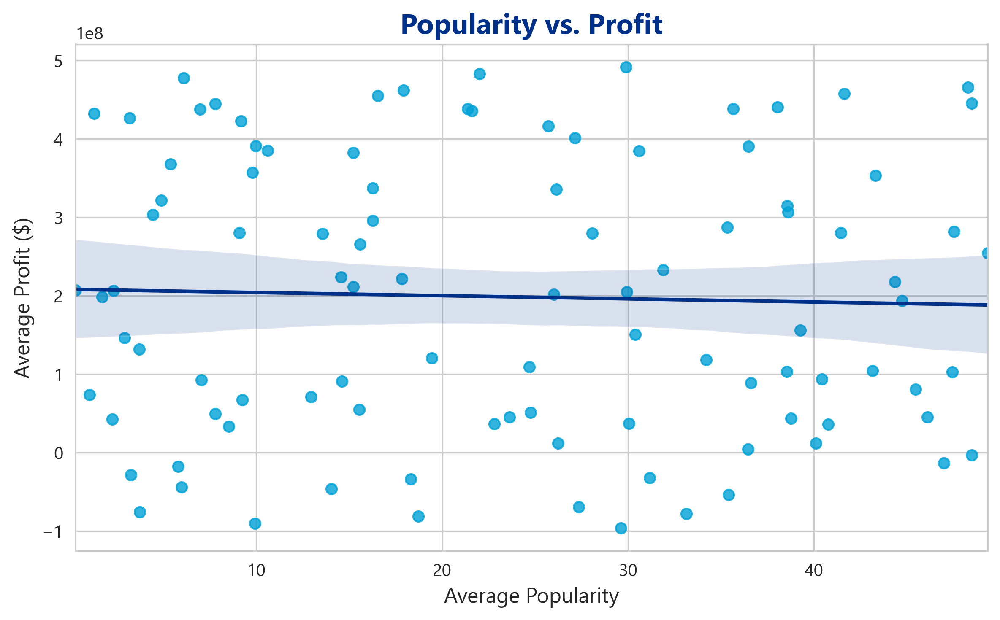
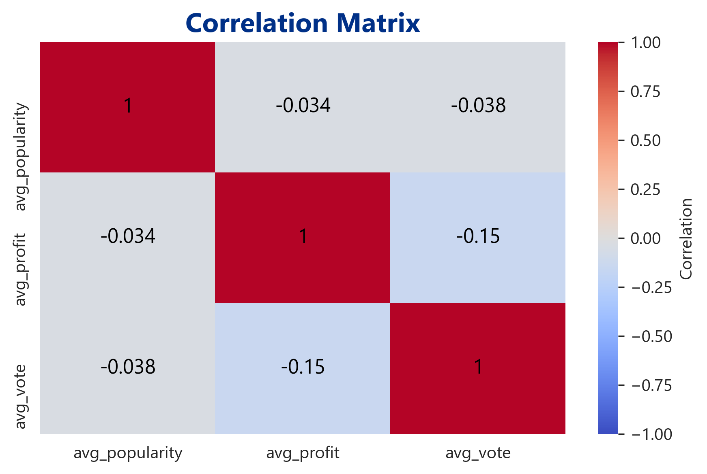
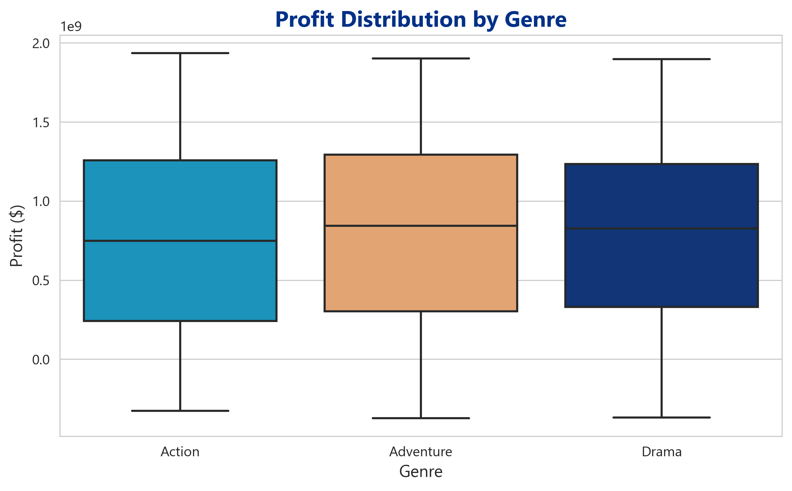

 # VIEWERS PRODUCTION STUDIO - Movie Data Analysis

  ## Overview
   
   This project analyzes historical movie data to identify trends in genres, budgets, and release timings that contribute to box office success. The goal is to provide actionable insights for a new movie studio, \"Viewers Production Studio,\" to make data-driven decisions about film production.
 
   ## Business Understanding
  
   Viewers Production Studio is entering the movie industry and needs to make informed decisions about film production to maximize profitability. This analysis aims to identify key factors that contribute to box office success, such as genres, budgets, and release timings, by examining historical movie data.
   
   ## Data Understanding
    
   The analysis utilizes several datasets:
    
   - **bom.movie_gross.csv**: Contains box office gross data, including domestic and foreign receipts.
   - **tmdb.movies.csv**: Provides movie metadata from The Movie Database (TMDb), including genres, popularity, and release dates.
   - **tn.movie_budgets.csv**: Includes production budgets and worldwide gross figures.
   - **im.db**: An SQLite database with additional movie information.
   
   These datasets were cleaned and preprocessed to handle missing values, convert data types, and remove duplicates.
   
   ## Data Understanding and Analysis
   
   The analysis involved:
    
   - Exploring the relationship between movie genres and profitability.
   - Investigating how release timing affects box office revenue.
   - Examining the correlation between production budgets and return on investment (ROI).
   - Conducting statistical tests, such as ANOVA, to assess the significance of findings related to genre profitability.
   
   Key findings include:
    
   - **Popularity vs. Profit**: A moderate positive correlation (r = 0.40) exists between movie popularity and profit, but it is not a strong predictor of financial success.

   - **Ratings Impact**: Movie ratings (vote averages) show a very weak correlation (r = 0.10) with profit, indicating that high ratings do not necessarily lead to high profits.

   - **Genre Profitability**: ANOVA testing (F-statistic: 1.96, p-value: 0.14) shows no significant difference in profitability among the top three movie genres, suggesting genre alone 
     is not a determinant of success.

   
   ## Conclusion
    
   Based on the analysis, the following recommendations are provided:
    
   - **Prioritize High-ROI Genres**: Focus on genres with historically high returns on investment rather than just popular ones (e.g., Fantasy-Romance or Adventure-Drama-Sport).
   - **Optimize Beyond Popularity**: Consider factors like budget efficiency, release timing, and market trends in addition to popularity and ratings when planning film production.
 
